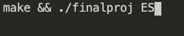
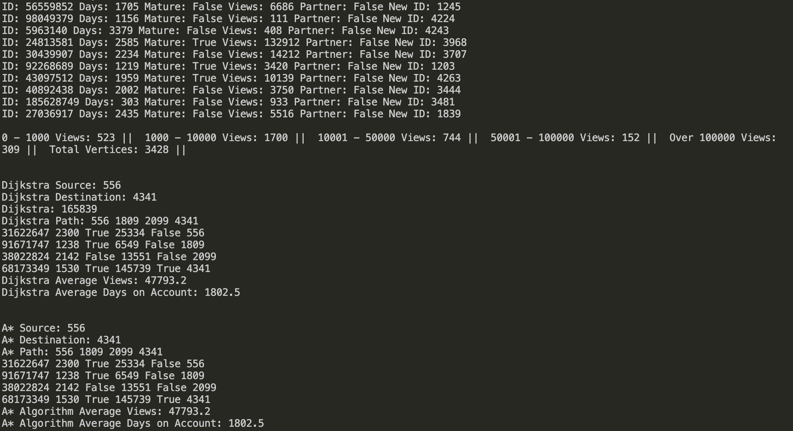

# CS225 Twitch Final Project

Author: Ansh Bhalla, Pranav Srinivasan, Raj Pulugurtha

---

**How To Run Dataset Analysis**
-
- To run the Dataset Analysis, type the following command into the terminal: make && ./finalproj ES
- In the case that the destination could not be found, the terminal will indicate: "The chosen destination could not be found. This may be due to the starting and ending nodes being in different connected components". 
- An example is provided below:

**Analysis Output**
-
- When the analysis command is run, the program outputs a series of values that were created based on the different algorithms. The first algorithm that the program runs is the BFS algorithm, which prints out the features of the user that is currently being traversed. Following this printing of the traversals, data is outputted regarding the views of all the people in the graph. The views are placed into categories based on the amounts and the terminal will display the number of users under each category of views. The second and third algorithms that the program runs is the Dijkstra Algorithm and the A* Algorithm which print out a variety of information. First, the source and destination vertexes are printed out followed by the path and distance that was taken to go from the source to the destination. The features of each user in the path are printed out for a better visualization. Finally, the average number of views and the average number of days of the account creation are then calculated and displayed. 

 
**Algorithms**  
-
- Our project involved using three different algorithms in order to gather and analyze the data. The first algorithm that was uses was the Breadth-First Search algorithm, or BFS. The BFS algorithm was used to traverse the graph and go through each vertex from the starting node in order to access each user's features. The Dijkstra Algorithm was used to find the shortest path between two users, or between two vertexes. This was accomplished by utilizing a priority queue, keeping track of the distances for each vertex, and keeping track of the previous vertex for each vertex in the graph. Using this, we were able to go through each of the edges and update the distance values. Finally, we simply traced back the path and returned both the path of vertices and the distance of the path. The third algorithm that we used in our project is the A* algorithm which also find the shortest path between two vertices. This was done by creating maps for different weight values of the vertices along with a priority queue to keep track of the discovered vertices. In the A* algorithm, we used a heuristic function which is a part of the A* implementation and this allows for the algorithm to add values in the map which will be used to find the shortest path between the vertices. Similar to Dijkstra, the path of vertices will be outputted, and if the destination was not found, a message will be printed out.

**Files**
-
- main.cpp
- parser.h / parser.cpp (reading text files and converting into vector)
- interpretgraph.h / interpretgraph.cpp (Graph Creation)
- GraphAlgo.h / GraphAlgo.cpp (Dijkstra and A*)
- graph.h / graph.cpp (Base Graph File + BFS)
- musae_ES_edges.csv/musae_ES_target.csv (Data - Larger Sample Size)
- musae_TEST_edges.csv/musae_TEST_target.csv (Data - Smaller Sample Size)
